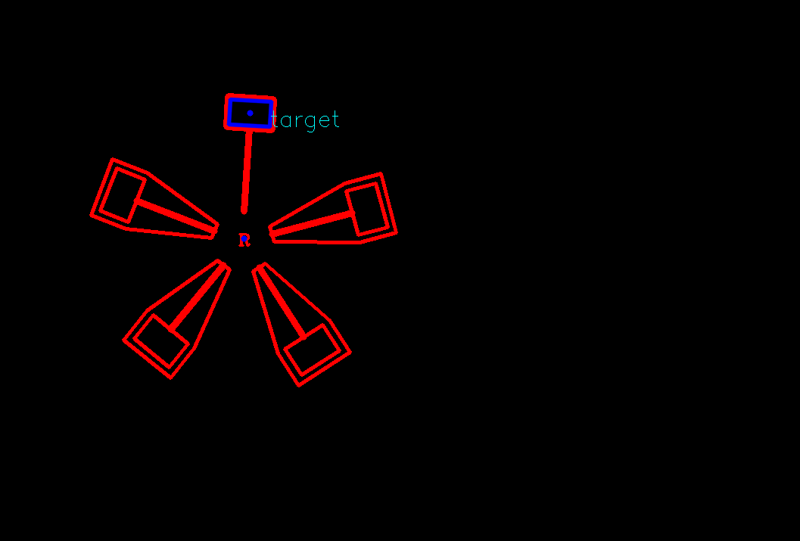
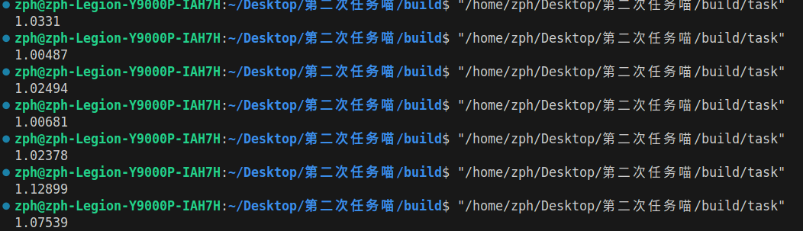

# RMV-Task03
# 结果
 
 除中心点绘制外，绘制出了锤子的内轮廓
 
 运行时间约在1.0s左右，~注释掉绘制部分或许会更快~
# 安装ceres

按照任务书里安装依赖，没有出现问题，在安装ceres时，参考了知乎上的文章[Ubuntu20.04安装Ceres1.14.0 - 知乎 (zhihu.com)](https://zhuanlan.zhihu.com/p/460685629#:~:text=1、 安装依赖库：),但是在使用时出现了第一个问题：__连接不到ceres库__

解决方法：重新编译安装一次ceres

# 识别R标和锤子并绘制

在本部分，参考了很多网上开源的文章，[RM圆桌](https://www.robomaster.com/zh-CN/resource/pages/activities/1015)，[了解视觉组](https://blog.csdn.net/weixin_42754478/article/details/108159529#:~:text=%E9%80%9A%E8%BF%87%E5%AF%B9%E8%A3%85%E7%94%B2%E6%9D%BF%E8%BF%9B%E8%A1%8C%E6%95%B0%E5%AD%97)，[RM_Buff_Tracker_GUT](https://github.com/DH13768095744/RM_Buff_Tracker_GUT.git)，[大符识别](https://blog.csdn.net/qq_43667130/article/details/105276577#:~:text=%E5%B0%B1%E4%BB%A5RoboMast)，主要思路来自最后一篇文章，二值化之后再寻找轮廓，不过对于RM_Buff_Tracker_GUT中提到的膨胀和大符识别中闭操作，在实际应用中作用并不是很明显，故在此将其删去，使用RM圆桌中提到的findContours函数和minAreaRect函数组合完成任务要求，寻找到R标和锤子的中心点，绘制圆圈。

# 风车转速拟合

主要依靠chatgpt，[B站上的讲解](https://www.bilibili.com/video/BV14D4y1A7Lj/?spm_id_from=333.337.search-card.all.click&vd_source=8770d56010b0e34f5cc1d7a504162aac)和[CSDN](https://blog.csdn.net/qq_39400324/article/details/123527022#:~:text=前文用 Eigen库)上的文章。有关残差计算部分，采用sinx来解决pi/2可能会出现的精度问题，使用Slover解决问题，这时出现了第二个问题：__cosx和sinx函数重载__，在使用命名空间ceres后，ceres::cosx(sinx)和

std::cosx(sinx)指代不明，导致程序无法正常运行

解决方法：在cosx(sinx)前加上ceres::

第三个问题：__cout函数也会显示上述问题__

解决方法：但是不影响正常运行，且一段时间莫名其妙自己消失了
